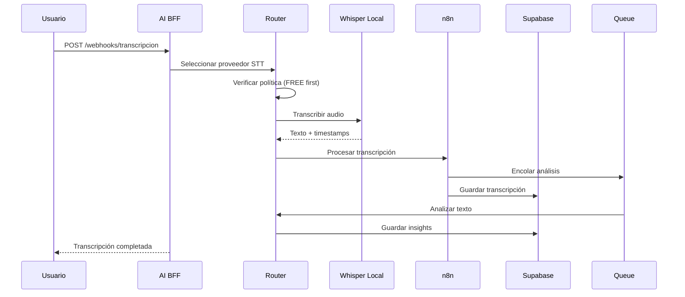
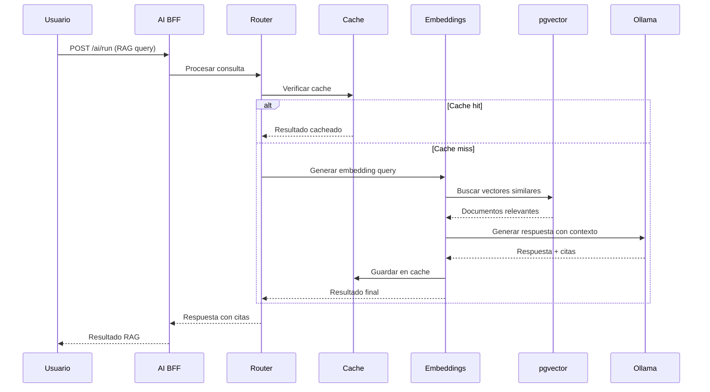
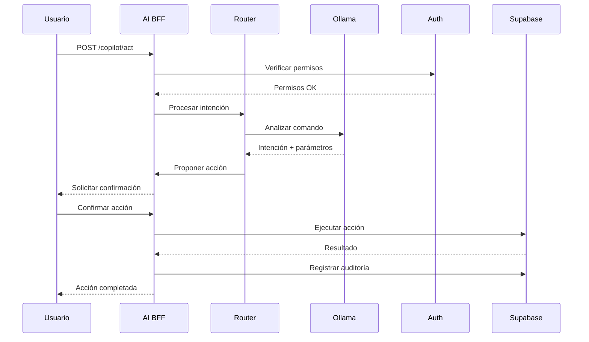
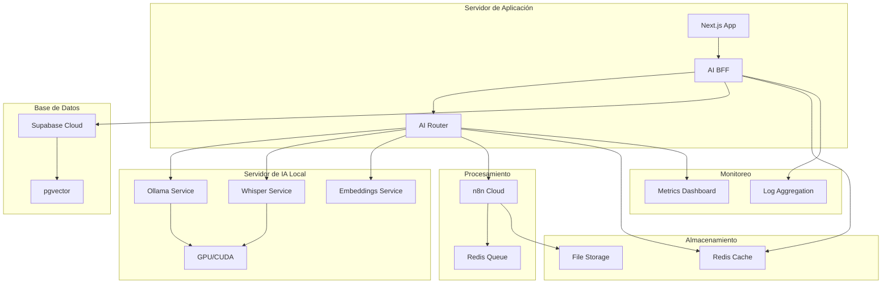
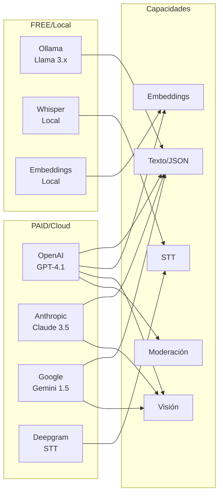

# Diagrama de Arquitectura Detallado - Sistema de IA

## Arquitectura de Alto Nivel

```mermaid
graph TB
    subgraph "Frontend Layer"
        WEB[Next.js App]
        UI[UI Components]
        DASHBOARD[Dashboard IA]
    end
    
    subgraph "BFF Layer"
        BFF[AI BFF Server]
        AI_RUN[/ai/run]
        COPILOT[/copilot/act]
        WEBHOOKS[/webhooks/*]
        AUTH[Auth Middleware]
    end
    
    subgraph "Router Layer"
        ROUTER[AI Model Router]
        POLICY[Policy Engine]
        CACHE[Result Cache]
        COST[Cost Controller]
    end
    
    subgraph "Provider Layer - FREE"
        OLLAMA[Ollama Local<br/>Llama 3.x]
        WHISPER[Whisper Local<br/>STT]
        EMBEDDINGS[Local Embeddings<br/>nomic-embed]
    end
    
    subgraph "Provider Layer - PAID"
        OPENAI[OpenAI API<br/>GPT-4.1/Embeddings]
        ANTHROPIC[Anthropic API<br/>Claude 3.5]
        GOOGLE[Google AI<br/>Gemini 1.5]
        DEEPGRAM[Deepgram API<br/>STT]
    end
    
    subgraph "Data Layer"
        SUPABASE[(Supabase)]
        VECTORS[(pgvector<br/>Embeddings)]
        TABLES[(AI Tables<br/>ai_runs, insights)]
        RLS[Row Level Security]
    end
    
    subgraph "Processing Layer"
        N8N[n8n Workflows]
        QUEUES[Task Queues<br/>Bull/BullMQ]
        STORAGE[File Storage<br/>Audio/Video]
        TRANSCRIPTION[Transcription Pipeline]
    end
    
    subgraph "Observability"
        LOGS[Structured Logs]
        METRICS[Metrics & Monitoring]
        TRACING[Distributed Tracing]
        ALERTS[Cost Alerts]
    end
    
    %% Connections
    WEB --> BFF
    UI --> BFF
    DASHBOARD --> BFF
    
    BFF --> AUTH
    BFF --> ROUTER
    BFF --> SUPABASE
    
    ROUTER --> POLICY
    ROUTER --> CACHE
    ROUTER --> COST
    
    ROUTER --> OLLAMA
    ROUTER --> WHISPER
    ROUTER --> EMBEDDINGS
    ROUTER --> OPENAI
    ROUTER --> ANTHROPIC
    ROUTER --> GOOGLE
    ROUTER --> DEEPGRAM
    
    ROUTER --> N8N
    N8N --> QUEUES
    N8N --> STORAGE
    N8N --> TRANSCRIPTION
    N8N --> SUPABASE
    
    SUPABASE --> VECTORS
    SUPABASE --> TABLES
    SUPABASE --> RLS
    
    BFF --> LOGS
    ROUTER --> METRICS
    N8N --> TRACING
    COST --> ALERTS
```

## Flujo de Datos - Transcripción



## Flujo de Datos - RAG Query



## Flujo de Datos - Copilot Operativo



## Arquitectura de Despliegue



## Matriz de Capacidades por Proveedor



---

**Diagramas generados**: $(date)
**Versión**: 1.0
**Estado**: Arquitectura Técnica
