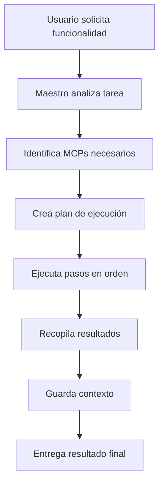
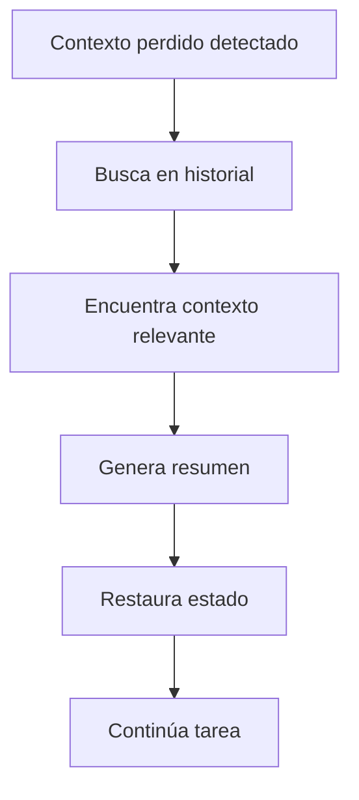

# 🎯 MCP MAESTRO - Orquestador Principal

> **El cerebro central que coordina todos los MCPs especializados para la plataforma Central de Creadores**

## 📋 Descripción

El MCP Maestro es el orquestador principal del sistema de MCPs especializados. Su función principal es:

- 🧠 **Coordinar** todos los demás MCPs especializados
- 💾 **Mantener contexto** persistente entre sesiones
- 🔄 **Recuperar contexto** perdido automáticamente
- 📊 **Gestionar el estado** global del proyecto
- 🎯 **Decidir qué MCPs** activar según la tarea
- 📋 **Rastrear decisiones** importantes del proyecto

## 🚀 Instalación y Configuración

### Prerrequisitos

- Node.js >= 18.0.0
- npm o yarn
- Acceso al workspace de Central de Creadores

### Instalación

```bash
cd mcp-system/mcp-maestro
npm install
```

### Configuración Inicial

1. **Verificar configuración de endpoints:**
   ```bash
   cat config/mcp-endpoints.json
   ```

2. **Crear directorios de storage:**
   ```bash
   mkdir -p storage/{sessions,context,decisions,backups}
   ```

3. **Probar conectividad:**
   ```bash
   npm run dev
   ```

## 🛠️ Capacidades Principales

### 🎯 Orquestación de Tareas
```javascript
{
  "tool": "orchestrate_task",
  "description": "Coordina tareas complejas entre múltiples MCPs",
  "example": {
    "task_description": "Crear componente modal con autenticación",
    "context_hints": ["diseño", "supabase"],
    "priority": "high"
  }
}
```

### 🔍 Recuperación de Contexto
```javascript
{
  "tool": "recover_context",
  "description": "Recupera contexto perdido de sesiones anteriores",
  "example": {
    "search_terms": ["modal", "autenticación"],
    "time_range": "last_week"
  }
}
```

### 🔄 Delegación a MCPs
```javascript
{
  "tool": "delegate_to_mcp",
  "description": "Delega tareas específicas a MCPs especializados",
  "example": {
    "target_mcp": "design-system",
    "action": "create_component",
    "payload": {
      "component_name": "AuthModal",
      "component_type": "modal"
    }
  }
}
```

### 📊 Estado del Sistema
```javascript
{
  "tool": "get_system_status",
  "description": "Obtiene estado completo del sistema de MCPs",
  "example": {
    "detailed": true
  }
}
```

### 💾 Gestión de Decisiones
```javascript
{
  "tool": "save_important_decision",
  "description": "Guarda decisiones importantes para futuras consultas",
  "example": {
    "decision_type": "architectural",
    "description": "Migrar a arquitectura basada en componentes",
    "impact_level": 4
  }
}
```

### 🔍 Base de Conocimiento
```javascript
{
  "tool": "query_knowledge_base",
  "description": "Consulta la base de conocimiento acumulada",
  "example": {
    "query": "componentes de autenticación",
    "knowledge_type": "solutions"
  }
}
```

## 🏗️ Arquitectura del Sistema

### Componentes Principales

```
mcp-maestro/
├── server.js                 # Servidor principal MCP
├── tools/                    # Herramientas especializadas
│   ├── context-manager.js    # Gestión de contexto
│   ├── mcp-dispatcher.js     # Comunicación con MCPs
│   ├── session-manager.js    # Gestión de sesiones
│   └── decision-tracker.js   # Rastreo de decisiones
├── config/                   # Configuración
│   └── mcp-endpoints.json    # Endpoints de MCPs
├── storage/                  # Almacenamiento persistente
│   ├── sessions.json         # Sesiones activas
│   ├── context.json          # Contexto histórico
│   ├── decisions.json        # Decisiones importantes
│   └── project_state.json    # Estado del proyecto
└── knowledge/               # Base de conocimiento
    ├── patterns.json        # Patrones comunes
    ├── solutions.json       # Soluciones probadas
    └── configurations.json  # Configuraciones óptimas
```

### MCPs Especializados Coordinados

1. **🎨 design-system** - Componentes UI, tokens, temas
2. **🗄️ supabase** - Base de datos, backend, APIs  
3. **💻 code-structure** - Estructura, refactoring, organización
4. **🧪 testing-qa** - Testing, debugging, calidad
5. **🚀 deploy-devops** - CI/CD, deployment, monitoring
6. **📚 documentation** - Documentación, guías, knowledge

## 🔄 Flujos de Trabajo

### Flujo 1: Crear Nueva Funcionalidad



### Flujo 2: Recuperación de Contexto



## 📊 Métricas y Monitoreo

### Métricas Clave
- ✅ **Tasa de éxito** de orquestación
- ⏱️ **Tiempo promedio** de ejecución
- 🔄 **Uso de MCPs** por tipo de tarea
- 💾 **Efectividad** de recuperación de contexto
- 📈 **Tendencias** de decisiones

### Logs y Debugging
```bash
# Ver logs en tiempo real
npm run dev

# Verificar estado de MCPs
curl http://localhost:3000/health

# Exportar métricas
curl http://localhost:3000/metrics
```

## 🔧 Configuración Avanzada

### Variables de Entorno
```bash
# .env
MCP_MAESTRO_PORT=3000
MCP_TIMEOUT_SECONDS=30
MAX_CONCURRENT_MCPS=3
CONTEXT_RETENTION_DAYS=30
LOG_LEVEL=info
```

### Configuración de MCPs
Editar `config/mcp-endpoints.json` para:
- Agregar nuevos MCPs
- Modificar capacidades
- Ajustar timeouts
- Configurar dependencias

### Storage Personalizado
```javascript
// Configurar storage personalizado
const customStorage = {
  type: 'database', // 'file' | 'database' | 'cloud'
  connection: 'postgresql://...',
  options: {
    encryption: true,
    compression: true
  }
};
```

## 🚨 Troubleshooting

### Problemas Comunes

#### MCP No Responde
```bash
# Verificar estado
npm run check-mcps

# Reiniciar MCP específico
npm run restart-mcp design-system
```

#### Contexto Perdido
```bash
# Forzar recuperación
npm run recover-context --force

# Verificar integridad
npm run verify-context
```

#### Performance Lenta
```bash
# Limpiar storage
npm run cleanup-storage

# Optimizar base de conocimiento
npm run optimize-knowledge
```

### Logs de Error
```bash
# Ver logs detallados
tail -f storage/logs/maestro.log

# Filtrar errores
grep "ERROR" storage/logs/*.log
```

## 🔐 Seguridad

### Buenas Prácticas
- 🔒 **Encriptar** datos sensibles en storage
- 🛡️ **Validar** todas las entradas de usuario
- 📝 **Auditar** decisiones importantes
- 🔄 **Rotar** tokens de acceso regularmente

### Permisos
```json
{
  "maestro": {
    "read": ["all"],
    "write": ["context", "sessions", "decisions"],
    "execute": ["orchestrate", "delegate", "recover"]
  }
}
```

## 📈 Roadmap

### Versión 1.1 (Próximo mes)
- [ ] Interfaz web para monitoreo
- [ ] API REST para integraciones
- [ ] Machine learning para predicciones
- [ ] Métricas avanzadas

### Versión 1.2 (Próximos 3 meses)
- [ ] Clustering de MCPs
- [ ] Auto-scaling dinámico
- [ ] Integración con servicios cloud
- [ ] Dashboard en tiempo real

## 🤝 Contribución

### Desarrollo Local
```bash
# Clonar repositorio
git clone https://github.com/elkingarcia22/central-de-creadores.git
cd central-de-creadores/mcp-system/mcp-maestro

# Instalar dependencias
npm install

# Ejecutar en modo desarrollo
npm run dev

# Ejecutar tests
npm test
```

### Agregar Nuevo MCP
1. Crear directorio en `mcp-system/mcp-{nombre}/`
2. Implementar server.js con protocolo estándar
3. Agregar configuración en `mcp-endpoints.json`
4. Actualizar dependencias en maestro
5. Crear tests de integración

## 📞 Soporte

- **Issues**: [GitHub Issues](https://github.com/elkingarcia22/central-de-creadores/issues)
- **Documentación**: [Wiki del proyecto](https://github.com/elkingarcia22/central-de-creadores/wiki)
- **Email**: oficialchacal@gmail.com

## 📄 Licencia

MIT License - ver [LICENSE](../../LICENSE) para detalles.

---

**🎯 MCP Maestro v1.0.0** - Desarrollado con ❤️ para Central de Creadores